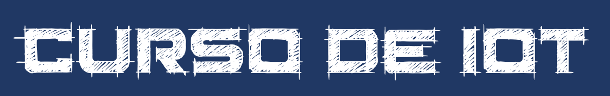

## Introdução 
IoT (do inglês Internet of Things) ou Internet das Coisas, como várias outras áreas do conhecimento humano é vasta, cobrindo dezenas de conceitos e tecnologias que se combinam para criar a IoT.

Enquanto isso possibilita inumeros cenários de negócio e melhoria para a sociedade, começar com IoT pode ser  intimidador e levar os interessados a simplesmente se deter diante de sua complexidade.

Embora esta séria de Workshops não se proponha a ensinar IoT desde o nivel zero (se voce ainda nao sabe o que é IoT estes workshops nao são pra voce), acreditamos que tenha potencial para ajudar muitas pessoas a começar.

## Pré-requisitos

Para voce ser bem sucedido em acompanhar estes workshops E aprender IoT, existem alguns pre-requisitos:

1. Espera-se que voce tenha **conhecimentos / graduação em TI** ou uma das disciplinas relacionadas a TI. 
2. Voce - mesmo recém formado - tem **conhecimento de alguma linguagem de programação**, 
3. **Sabe o que é IoT** - pode nao saber implementar nada, mas sabe o que é IoT, 
4. É um **auto-didata**: voce sabe pegar informacoes e criar seu conhecimento a partir destas informações, sem precisar ficar perguntando e tirando duvidas em cada pequeno passo do processo. 
5. Está disposto a **botar a mao na massa** e fazer cada exercício. Voce nao vai aprender nada se nao botar a mao na massa.
6. Está disposto a **investir seu tempo** no seu aprendizado. Além deste repo, eu criei varios videos no YouTube e o ideal é que voce consuma os dois: as infomracoes contidas aqui e assita aos videos com os detalhes. Alguns dos videos sao longos, passando de 30 minutos, o que é de se esperar dado que sao workshops. 
7. Tem conhecimentos, ao menos básicos, de **inglês**. Varios exemplos, ferramentas e websites estao disponíveis apenas em inglês, por isso a proficiencia basica/intermediária, especialmente em inglês técnico é muito importante.
8. Está disposto a investir dinheiro ao **adquirir ao menos uma placa ESP8266** (custa por volta de R$30,00 no Mercado Livre), mas eu vou mostrar exemplos mais avançados que irão requerer mais partes além do ESP8266. Sugestão: pare de comer fast-food nos próximos meses para investir o dinheiro em aprendizado de IoT, seu colesterol e seu futuro agradecem. 

## Escopo dos Workshops

Nos workshops que fazem parte desse repositório, nos vamos cobrir os seguintes aspectos de IoT:

- [Setup da maquina de desenvolvimento](setup.md)
- [MQTT - Protocolo da IoT](mqtt.md)
- [MQTT - Continuação](mqtt2.md)
- Hardware para IoT
    - ESP8266
    - Arduino IDE
    - Sensores e Atuadores
    - Eletronica básica para devices
- Servidor MQTT local
    - MQTT Broker
    - Tratamento de dados
    - Banco de Dados TimeSeries
    - Visualização de dados
- Movendo o Servidor pra nuvem - Azure IaaS
    - Setup servidor
    - Setup IoT
    - Desafios
- Movendo para o modelo Paas - Azure IoT Hub
    - Funcionalidades do IoT Hub
    - Usando o C SDK em devices reais

Esta lista pode e será atualizada conforme o andamento do curso.

## Fora do Escopo

Tão importante quanto definir o que será abordado é deixar claro o que não será:

- Não teremos exemplos de devices baseados em Windows ou Linux - nós vamos focar apenas em devices restritos, aqueles que tem pouca memória e que não sao capazes de rodar um SO (sistema operacional) completo.
- Consultoria / garantia: fique a vontade para consumir tudo o que estiver neste repositório para seu uso pessoal e profissional, mas nada nele vem com garantia de funcionamento, ausencia de bugs, garantia de atualizacao no futuro, etc. Se voce encontrar um erro (desde gramática até bugs no código, por favor crie um Issue ou - melhor ainda - abra uma PR que eu verificarei cada uma delas)
- Exemplos em qualquer linguagem de programação que nao seja C (padrão ANSI C - C99). Também está fora do escopo ensinar programacao em C. 
- Exemplos em outras plataformas de Nuvem: todos os exemplos serão baseados no Azure da Microsoft. Nós tentaremos ao máximo manter os exemplso com recursos gratuitos ou trial, mas nao podemos garantir que estes recursos serão sempre gratuitos. 

## Contribuindo

Este projeto aceita contribuições e sugestões. Se voce tem algo a acrescentar, por favor crie uma PR com sua sugestão que eu terei o maior prazer em rever. Se voce encontrou um erro, me deixe saber via GitHub issue. 

Nao aceitamos pedidos de desenvolvimento de projetos, nem criaremos solucoes específicas para nenhuma empresa ou pessoa física. O conteúdo deste repositório é disponível como está sem nenhuma garantia. 
