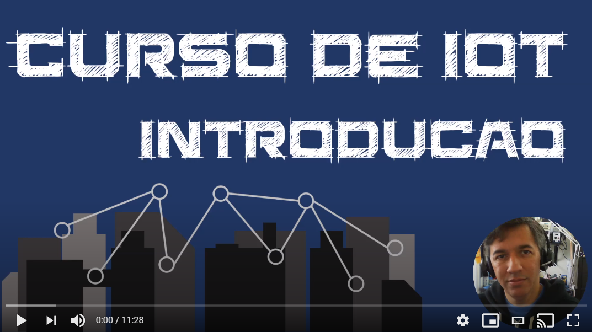

## Introdução 
IoT (do inglês Internet of Things) ou Internet das Coisas, como várias outras áreas do conhecimento humano é vasta, cobrindo dezenas de conceitos e tecnologias que se combinam para criar a IoT.

Enquanto isso possibilita inúmeros cenários de negócio e melhoria para a sociedade, começar com IoT pode ser  intimidador. Ao ponto de que uma pessoa interessada sequer comece a estudar, por não saber por onde começar. 

Eu mesmo estive nessa situacao há alguns anos atrás: eu queria criar um pequeno device (ou dispositivo, e uso os dois termos mas eles sao a mesma coisa) de IoT, tipo um Arduino ou similar que pudesse conectar no Wi-Fi. Depois esse device ia mandar dados de telemetria (temperatura) pra um serviço na nuvem eu eu ia poder ver esses dados online. Parece uma tarefa simples, mas em 2014, essa tarefa foi bem mais complexa do que eu esperava. 

Mesmo avançando no tempo para hoje, 2021, embora existam duzias de workshops e videos sobre IoT o começo, o primeiro passo ainda é o mais difícil. Espero que o conteúdo deste repositório ajude todas as pessoas que se interessam por IoT e que não sabem qual o primeiro passo.

### Video

O link abaixo para o meu canal do YouTube traz um pouco mais de detalhes sobre o curso.

## Pré-requisitos

Para voce ser bem sucedido em acompanhar estes workshops e aprender IoT, existem alguns pré-requisitos importantes:

1. Espera-se que voce tenha **conhecimentos / graduação em TI** ou uma das disciplinas relacionadas a TI.
2. Voce - mesmo recém formado - tem **conhecimento de alguma linguagem de programação**,
3. **Sabe o que é IoT** - pode não ter conhecimento prático, mas sabe o que é IoT,
4. É um **auto-didata**: voce sabe pegar informações e criar seu conhecimento a partir destas informações, sem precisar ficar perguntando e tirando duvidas em cada passo do processo. 
5. Está disposto a **botar a mão na massa** e fazer cada exercício. Voce não vai aprender muito se não botar a mao na massa.
6. Está disposto a **investir seu tempo** no seu aprendizado. Além deste repo (repositório), eu criei varios videos no YouTube e o ideal é que voce consuma os dois: as informações contidas aqui e assita aos videos com os detalhes. Alguns dos videos são longos, passando de 30 minutos, o que é de se esperar dado que são workshops.
7. Tem conhecimento, ao menos básico, de **inglês**. Vários exemplos, ferramentas e websites estão disponíveis apenas em inglês, por isso o conhecimento especialmente em inglês técnico é muito importante.
8. Está disposto a investir dinheiro ao **adquirir ao menos uma placa ESP8266** (custa por volta de R$30,00 no Mercado Livre em 2021), mas eu vou mostrar exemplos mais avançados que irão requerer mais partes além do ESP8266, como um Raspberry Pi, sensores, etc. Sugestão: pare de comer fast-food nos próximos meses para investir o dinheiro em aprendizado de IoT, seu colesterol e seu futuro agradecem.

## Escopo dos Workshops

Nos workshops que fazem parte desse repositório, eu vou cobrir os seguintes aspectos de IoT:

- [Setup da maquina de desenvolvimento](setup.md)
- [MQTT - Protocolo da IoT](mqtt.md)
- [MQTT - Continuação](mqtt2.md)
- [Hardware para IoT](devices.md)
    - ESP8266 - Node MCU
    - Arduino IDE
    - Visão geral de Sensores e Atuadores
    - Criando o circuito básico
    - Criando uma conta no IO.Adafruit.com 
    - Teste do device mandando dados de telemetria
- [Servidor MQTT local](local.md)
    - MQTT Broker
    - Conectando o ESP8266 neste servidor local
    - Tratamento de dados
    - Banco de Dados TimeSeries
    - Visualização de dados
- Movendo o Servidor pra nuvem - Azure IaaS
    - Setup servidor
    - Setup IoT
    - Setup do ESP8266
    - Desafios
- Movendo para o modelo Paas - Azure IoT Hub
    - Funcionalidades do IoT Hub
    - Usando o C SDK em devices reais

Esta lista está sujeita a mudanças.

## Fora do Escopo

Vamos setar as expectativas. Tão importante quanto definir o que será abordado é deixar claro o que não será:

- Não teremos exemplos de devices baseados em Windows ou Linux - nós vamos focar apenas em devices restritos, aqueles que tem pouca memória e que não são capazes de rodar um SO (sistema operacional) completo. Raspberry Pi, por exemplo, não é um device restrito e para os fins desse workshop ele será usado com um Servidor.
- Consultoria / garantia: fique a vontade para consumir tudo o que estiver neste repositório para seu uso pessoal e mesmo profissional. Mas faça isso sabendo qeu mas nada neste repo vem com garantia de funcionamento, garantia de ausência de bugs, garantia de atualização no futuro, etc. Se voce encontrar um erro (desde gramática até bugs no código), por favor crie um Issue ou - melhor ainda - abra uma PR que eu verificarei cada uma delas.
- Exemplos em qualquer linguagem de programação que não seja C (padrão ANSI C - C99). Também está fora do escopo ensinar programação em C.
- Exemplos em outras plataformas de Nuvem: todos os exemplos serão baseados no Azure da Microsoft (que é o que eu conheço). Eu também mostrarei exemplos com recursos gratuitos ou trial, mas em um determinado ponto do curso vou usar recursos profissionais da plataforma.

## Contribuindo

Este projeto aceita contribuições e sugestões. Se voce tem algo a acrescentar, por favor crie uma PR (Pull Request) com sua sugestão que eu terei o maior prazer em rever. Se voce encontrou um erro, me deixe saber via GitHub issue.

Neste momento eu não aceito pedidos de desenvolvimento de projetos, nem pedidos de solucoes específicas para empresas ou pessoas físicas. O conteúdo deste repositório é disponível como está, sem nenhuma garantia.
