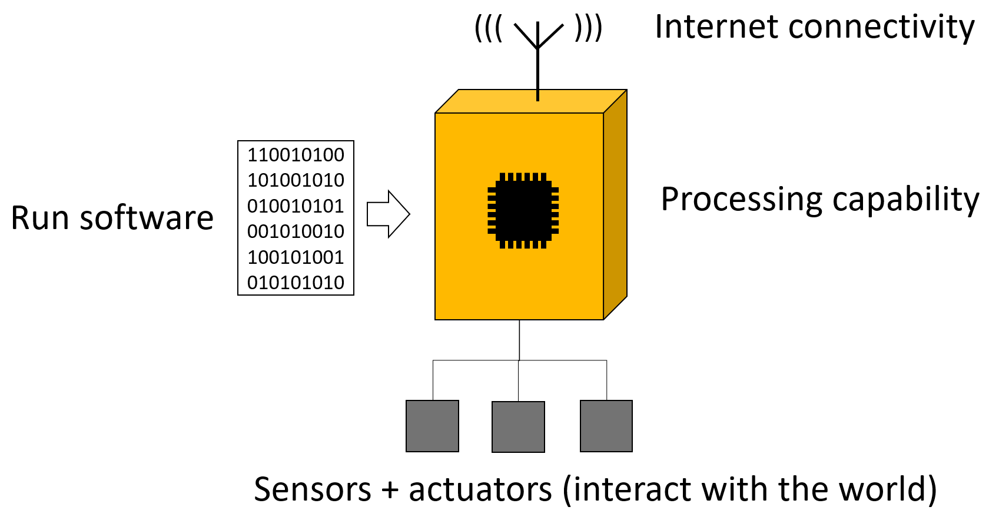
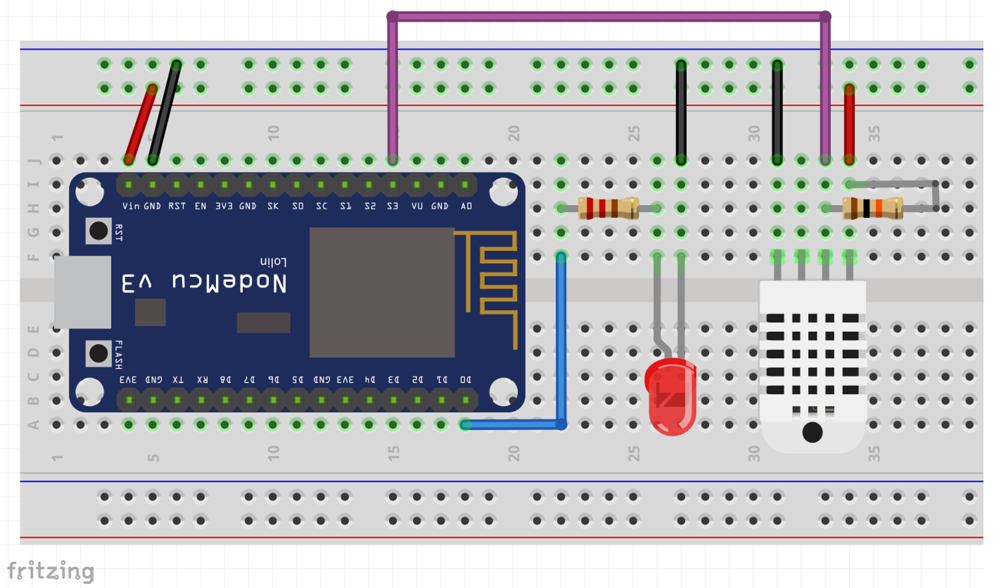
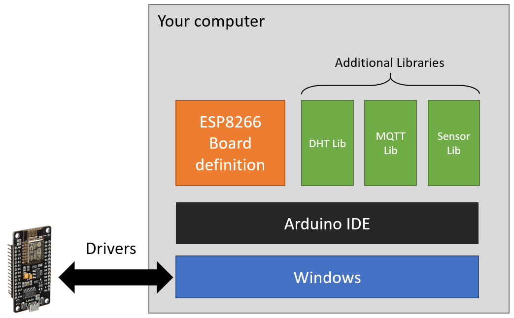

## Devices para IoT

No conceito de Internet das Coisas, o que é uma coisa?

Em sua forma mais básica, uma coisa ou device, possui as seguintes características:

- Conexão com a Internet - essa conexão pode ser wireless (Wi-Fi, Celular, Bluetooth, etc) ou cabeada (Ethernet). 
- Capacidade de processamento - os devices tem alguma capacidade de processamento local
- Executa Software - neste caso o software executado no device é mais conhecido como Firmware e é este firmware que controla todas as atividades do device. 
- Interage com sersores e atuadores - que permitem que o device colete dados do mundo físico e os transforme em informações digitais mas também permitem o caminho contrário onde sinais digitais se transformam em ações físicas.



### Video

O link abaixo para o meu canal do YouTube traz um pouco mais de detalhes sobre devices para IoT.

[](https://youtu.be/ItrVKlmpxF0)

## Mão na massa

Para essa parte do curso voce precisa de alguns componentes eletrônicos:

1. ESP8266 (Node MCU) - Esse é o kit de desenvolvimento Wi-Fi
1. DHT11 - Sensor de temperatura e umidade
1. Protoboard / Breadboard - placa que dará sustentação mecânica e conexão elétrica dos componentes
1. LED - pode ser de qualquer cor
1. Resistores: 
    1. 10K (marrom, preto, laranja) uma peça 1/4W
    1. 330R (laranja, laranja, marrom) uma peça 1/4W
1. Fios para conexão (idealmente cabinho rígido AWG22)

### Montagem no Breadboard:

A figura abaixo mostra como os componentes devem ser posicionados e as ligações entre os mesmos. A cor dos fios não é importante, desde que todos estejam ligados nas posições corretas voce pode usar qualquer cor. Esse diagrama mostra o DHT22 (componente branco), mas na verdade nós utilizaremos o DHT11 (azul).



### Setup do device no seu computador

Depois de ter feito o setup das peças no breadboard, podemos passar para o proximo passo que é instalar software e driver que permitirá que seu computador seja capaz de programar o device. 

Para isso nós iremos: 

1. Instalar o [Arduino IDE](www.arduino.cc)
1. Instalar o suporte para o ESP8266 no Arduino IDE, usando a string abaixo:

```
http://arduino.esp8266.com/stable/package_esp8266com_index.json

```
3. Instalar as bibliotecas adicionais necessárias para o exemplo:
    1. DHT11 Lib
    1. Sensor Lib
    1. Adafruit MQTT 

Opcionalmente pode ser necessária a instalação de um driver adicional caso a sua placa ESP8266-Node MCU possua o chip CH340G. O video mostra os passos para instalação. 



Quando seu computador estiver configurado, voce pode pegar [este código de exemplo](sample-code/basic-test.ino) e carregar no seu ESP8266.

### Video

O link abaixo para o meu canal do YouTube mostra a instalação de todos os software listados acima, a montagem do circuito e a execução do código de teste.

[](https://youtu.be/ItrVKlmpxF0)