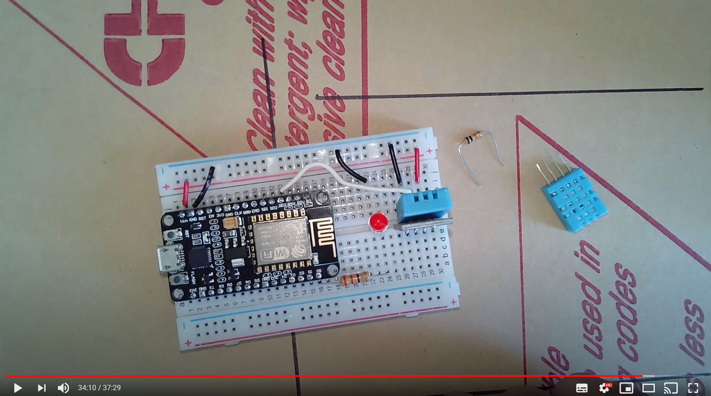
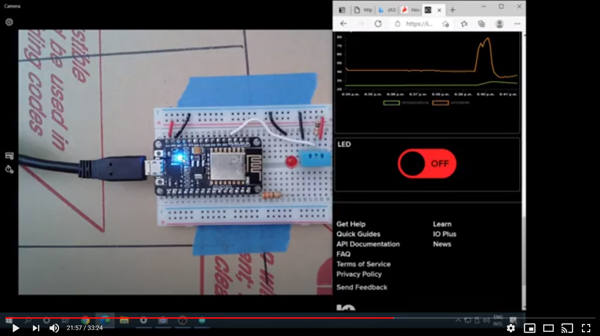

## Devices para IoT

No conceito de Internet das Coisas, o que é uma coisa?

Em sua forma mais básica, uma coisa ou device, possui as seguintes características:

- Conexão com a Internet - essa conexão pode ser wireless (Wi-Fi, Celular, Bluetooth, etc) ou cabeada (Ethernet). 
- Capacidade de processamento - os devices tem alguma capacidade de processamento local
- Executa Software - neste caso o software executado no device é mais conhecido como Firmware e é este firmware que controla todas as atividades do device. 
- Interage com sersores e atuadores - que permitem que o device colete dados do mundo físico e os transforme em informações digitais mas também permitem o caminho contrário onde sinais digitais se transformam em ações físicas.


### Video

O link abaixo para o meu canal do YouTube traz um pouco mais de detalhes sobre devices para IoT.

[](https://youtu.be/KkLqBPoI5O0)

## Mão na massa

Para essa parte do curso voce precisa de alguns componentes eletrônicos:

1. ESP8266 (Node MCU) - Esse é o kit de desenvolvimento Wi-Fi
1. DHT11 - Sensor de temperatura e umidade
1. Protoboard / Breadboard - placa que dará sustentação mecânica e conexão elétrica dos componentes
1. LED - pode ser de qualquer cor
1. Resistores: 
    1. 10K (marrom, preto, laranja) uma peça 1/4W
    1. 330R (laranja, laranja, marrom) uma peça 1/4W
1. Fios para conexão (idealmente cabinho rígido AWG22)

### Montagem no Breadboard:

A figura abaixo mostra como os componentes devem ser posicionados e as ligações entre os mesmos. A cor dos fios não é importante, desde que todos estejam ligados nas posições corretas voce pode usar qualquer cor. Esse diagrama mostra o DHT22 (componente branco), mas na verdade nós utilizaremos o DHT11 (azul).


### Setup do device no seu computador

Depois de ter feito o setup das peças no breadboard, podemos passar para o proximo passo que é instalar software e driver que permitirá que seu computador seja capaz de programar o device. 

Para isso nós iremos: 

1. Instalar o [Arduino IDE](www.arduino.cc)
1. Instalar o suporte para o ESP8266 no Arduino IDE, usando a string abaixo:

```
http://arduino.esp8266.com/stable/package_esp8266com_index.json

```
3. Instalar as bibliotecas adicionais necessárias para o exemplo:
    1. DHT11 Lib
    1. Sensor Lib
    1. Adafruit MQTT 

Opcionalmente pode ser necessária a instalação de um driver adicional caso a sua placa ESP8266-Node MCU possua o chip CH340G. O video mostra os passos para instalação. 


Quando seu computador estiver configurado, voce pode pegar [este código de exemplo](sample-code/basic-test.ino) e carregar no seu ESP8266.

### Video

O link abaixo para o meu canal do YouTube mostra a instalação de todos os software listados acima, a montagem do circuito e a execução do código de teste.

[](https://youtu.be/N7B_R-UfF4c)

### FAQ - Perguntas Frequentes

1. Conectei meu device no computador, instalei o driver (se for o CH340G), mas ele não aparece de jeito nenhum no Device Manager. Neste caso, verifique se o cabo USB que voce está usando é um cabo de dados. Vários cabos possuem internamente apenas 2 fios e são utilizados apenas para carregar a bateria de dispositivos USB. Neste caso, precisamos, além dos fios de alimentação, dos dois fios de dados. Se o seu cabo for um cabo de alimentacao apenas, voce nao vai conseguir programar o seu device. Na dúvida, procure comprar um cabo que voce tenha certeza que é de dados.
1.  Assisti o video mas fiquei com muitas duvidas no Arduino porque é a primeira vez que eu uso este tipo de programa. O que voce sugere? Se voce é iniciante em Arduino e programação de firmware em devices, a melhor maneira de aprender o básico é assistindo videos de Arduino 101, videos básicos e introdutórios de Arduino. Dois de meus canais brasileiros favoritos neste tópico são o canal do [Marlon Nardi](https://www.youtube.com/user/Marlon7642) e o do [Wagner Rambo](https://www.youtube.com/user/canalwrkits). 
1. Mesmo com a sua explicação ainda não entendi nada do código de exemplo. Na verdade esse código, embora simples do ponto de vista de exemplo pra IoT, ele já é consideravelmente avançado para programadores inciantes e, infelizmente, não há outro jeito para trabalhar num código que necessita de diversas bibliotecas externas, requer conexão com serviços web e também implementa reconexão automática. Os canais que mencionei acima podem te ajudar a entender circuitos e códigos mais simples que podem ser a base para entender códigos mais complexos.
1. Vale mesmo a pena comprar o ESP8266 pra acopanhar o curso? A compra é opcional. Mas, obviamente, voce nao será capaz de ver nenhum dos exemplos práticos funcionando dificultando e muito o seu aprendizado. Se voce puder fazer um esforço e comprar, o seu investimento de tempo será muito melhor aproveitado.
1. Conectei todos os componentes e o circuito não funciona. Caso voce experimente qualquer problema com a placa, siga o método do dividir para conquistar: teste  circtuito em partes.
    1. Remova o ESP8266 da protoboard e conecte o cabo USB nele. O computador reconhece a placa? (olhe no device manager) Se nao reconhecer ainda voce pode ter um cabo USB que não é de dados (veja item #1 acima). Se sua instalação de Arduino IDE for antiga, remova e reinstale: como o Arduino IDE instala vários driver para placas, eventualmente voce pode estar com drivers antigos.
    1. Se o computador reconhecer o ESP8266 tente programar ele sozinho, mesmo fora do protoboard. Se voce conseguir programar o seu ESP8266 e seu cabo USB estão funcionando corretamente.
    1. Volte o ESP8266 pra protoboard a verifique todas as suas conexões. 