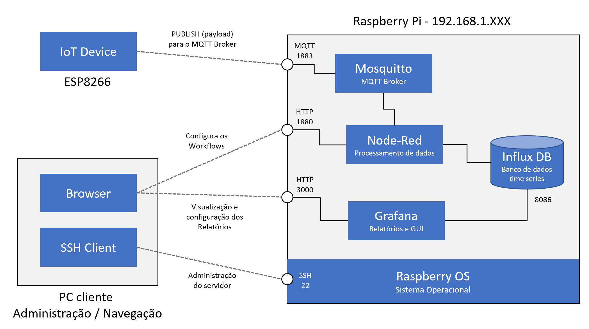

## Servidor de MQTT Local

Até esta parte do curso nós já temos um device (o ESP8266) conectado a um serviço online - io.adafruit.com -  e conseguimos mandar dados e receber comandos. Embora este servidor seja excelente para aprendizado e testes, ele não é indicado para cenários mais avançados por seus limites em quantidade de mensagens (mesmo o serviço pago deles ainda é bastante limitado) e ausencia d   e características básicas para a criação de uma solução mais robusta. 

Dessa forma vamos ter que avaliar alternativas ao serviço da Adafruit, e uma das forma mais simples de criar essa solução é criar uma nuvem privada, um serviço que nós vamos criar e manter, tendo assim total flexibilidade quanto a capacidade de hardware, quantidade de devices conectados, mensagens enviadas e etc.

Esta solução será baseada, a princípio, em um pequeno Raspberry Pi (um computador single board) que atuará como servidor da nossa solução. Claro que o Raspberry Pi não é poderoso o bastante para executar cenários com um numero alto de clientes, mas ele é perfeito para aprendermos a usar uma maquina Linux como um servidor. Caso voce nao tenha um Raspberry Pi disponível, pode usar uma maquina maior como um PC com Linux em seu lugar, mas nem todos os comandos são identicos, o que vai exigir que voce adapte alguns deles.

### Visão geral do que vamos construir

A figura abaixo mostra a solução para IoT que vamos construir nessa aula. Ela vai permitir que devices IoT com ESP8266 enviem dados de telemetria (nao teremos mais o limite de 30 mensagens por minuto como na Adafruit), esses dadso serão armazenados em um banco de dados indefinidamente (e não apenas por 30 dias) e teremos uma ferramenta para criar gráficos e relatórios poderosa. Todos os sofwares usados nessa aula são gratuitos.

Vamos olhar cada parte dessa solução:

1. **IoT Device**: Este é o device que usamos na aula passada, é um ESP8266 com um sensor de umidade e temperatura, DHT11.
1. **MQTT Broker - Mosquitto**: Usaremos, uma vez mais, o Mosquitto como MQTT broker dessa solução.
1. **Node-Red - Processamento de dados**: O Node-Red é uma ferramenta poderosa de processamento de dados / workflows e a utilizaremos para pegar as mensagens de telemetria recebidas no Mosquitto, ajustá-las para que sejam guardadas no banco de dados, e depois o Node-Red se encarrega de fazer o INSERT desses dados no Influx DB.
1. **Influx DB - Banco de dados**: este é um banco de dados NO-SQL do tipo Time Series que é perfeito para armazenarmos dados que fazem parte de uma série que varia no tempo, como a temperatura e a umidade enviados pelo device.
1. **Grafana - Relatórios e UI**: Assim como criamos dashboards no Adafruit para mostrar os valores de temperatura e a umidade criaremos uma visão similar no Grafana. Mas o Grafana é muitas vezesmais poderoso que o Dashboard da Adafruit, e é utilizado por várias empresas como sua solução oficial de dashboard.
1. **Browser**: Será utilizado tanto para visualização do dashboard, quanto para a configuração do Node-Red e do Grafana. 
1. **SSH Client - Windows Terminal**: Ao contrário do Node-Red e do Grafana que possuem interfaces gráficas via Web para configuração, o Mosquitto e o Influx DB possuem apenas interfaces de linha de comando. Da mesma fora a adminsitração geral do servidor Linux é feita via linha de comando, por este motivo iremos usar um cliente de SH (Secure Shell) para conectar ao servidor. 
1. **Raspberry OS**: Este é o sistema operacional utilizado pelo Raspberry Pi, mas se voce estiver no Linux em um PC, este pode ser substituído pelo Ubuntu ou qualquer outro tipo de Linux que suporte todos os serviços acima.



### Lado do servidor - Ingestão de dados

Neste passo vamos configurar o Raspberry Pi para ser o servidor IoT:

1. Conecte no seu Raspberry Pi via SSH
2. Faça o Update e Upgrade do seu Raspberry Pi

```bash
sudo apt-get update
sudo apt-get upgrade -y
```
3. Instale [Mosquitto](https://mosquitto.org/) - o MQTT broker

```bash
sudo apt-get install mosquitto -y
```

Teste sua instalação:


```bash
mosquitto
```

Se tudo deu certo, voce deve ver uma mernsagem de erro que diz "Address is already in use", o que significa que voce nao pode iniciar o Mosquitto porque ele já está rodando (o que é bom!).

4. Instale [Node Red](https://nodered.org/) - Este passo só é necesário caso voce nao esteja usando o Raspberry Pi. 
    - Node red requer que o Node JS e NPM sejam instalados como pré-requisito.


```bash
sudo apt-get install nodejs -y
sudo apt-get install npm -y
bash <(curl -sL https://raw.githubusercontent.com/node-red/linux-installers/master/deb/update-nodejs-and-nodered)

```
Executando o Node Red como um serviço (para que ele inicie automaticamente após cada boot):

```bash
sudo systemctl enable nodered.service
node-red-start
```

5. Verique se o Mosquitto e o Node-red estão rodando como serviço:
    
```bash
sudo systemctl status nodered
sudo systemctl status mosquitto
```

5. Verique o endereço IP do seu Raspberry Pi, que será usado nos proximos passos:
    
```bash
sudo ifconfig
```
- ETH0 é a porta que nos interessa caso voce esteja com um cabo de rede conectado no seu Raspberry Pi.

- XXX caso voce esteja usando Wi-Fi no raspberry Pi. 

6. Seu Raspberry Pi está pronto para receber mensagens MQTT do Device.


### Lado do Device - ESP8266 

**Importante**: vamos reusar o device e o setup do computador criados na aula passada. 

1. O código usado será o [local.ino](sample-code/local.ino), parecido com o que usamos anteriormente.

1. Carregue o código para seu ESP8266 e deixe-o ligado para que fique enviando mensagens pro servidor. Vamos usar essas dado para ajustar os proximos passos.

### Validação do fluxo de dados: Device --> Servidor

1. Para validar se o Mosquitto está recebendo as mensagens enviadas pelo device:

    -  Abra seu browser e vá pro Node-red: [IP do seu Raspberry Pi]:1880, no meu caso foi 192.168.1.46:1880  
    - Como o Node-red está configurado para acesso, voce deve ver uma tela de workflow em branco.
    - Copie o arquivo JSON abaixo (para copiar a linha toda, de um clique triplo na linha e depois CTRL+C)
    - No node-red, vá no menu superior direito, clique import e cole o JSON na janela.
    - Selecione import to current flow e clique em import
    
```json
[{"id":"9827e37.2cc092","type":"tab","label":"Teste do Mosquitto e Device","disabled":false,"info":""},{"id":"60606fbf.e3564","type":"mqtt in","z":"9827e37.2cc092","name":"Mosquitto-MQTT","topic":"WEATHER","qos":"0","datatype":"auto","broker":"386009ad.06dbd6","x":180,"y":140,"wires":[["d33adc0a.5f606"]]},{"id":"d33adc0a.5f606","type":"debug","z":"9827e37.2cc092","name":"","active":true,"tosidebar":true,"console":false,"tostatus":false,"complete":"false","statusVal":"","statusType":"auto","x":440,"y":220,"wires":[]},{"id":"386009ad.06dbd6","type":"mqtt-broker","z":"","name":"Mosquitto-Local","broker":"10.0.0.46","port":"1883","clientid":"","usetls":false,"compatmode":false,"keepalive":"60","cleansession":true,"birthTopic":"","birthQos":"0","birthPayload":"","closeTopic":"","closeQos":"0","closePayload":"","willTopic":"","willQos":"0","willPayload":""}]
```

2. Se tudi correr bem voce der ter o seguint workflow na sua janela:


3. Este workflow não vai funcionar automaticamente porque ele tem o IP incorreto:

    - De um clique duplo no node do Mosquitto, depois clique no lapis que aparece ao lado do server name
    - Atualize o IP do servidor e clique update e done
    - Clique no botão deploy
    - Se tudo deu certo, voce deve ver o icone do Mosquitto em verde e a mensagem connected, como a imagem acima mostra.
    - Vá até a janela de debug e olhe as mensagens chegando.
    
4. Se vce pude ver mensagens como a mostrada abaixo, chegando a cada 10 segundos, parabens! O setup do device até o mosquitto está funcionando. 

```html
7/3/2020, 4:23:27 PMnode: d33adc0a.5f606
WEATHER : msg.payload : string[37]
"ID=6363483;LOC=1;TEMP=22.90;HUM=58.00"
```
### Server Side - Bando de dados

1. Dada a natureza dos dados de telemetria que estamso mandando pro MQTT Broker, a melhor maneira de armazenar estes dados é comm um banco de dados de time series. Ele provê a melhor abordagem para responder a perguntas como:
    - Qual foi a temperatura méria ontem?
    - Qual a maior temperatura na semana passada?
    - Qual foi o dia mais seco dos últimos 2 meses?

Claro que qualquer banco de dados relacional comum é capaz de prover respostas a essas perguntas, mas este tipo de query é mais custoso e demorado que a mesma query num banco de dados de time series.

2. Instale o InfluxDB

```bash
sudo apt-get install influxdb -y 
sudo apt-get install influxdb-client -y
echo $INFLUXDB_CONFIG_PATH /etc/influxdb/influxdb.conf
sudo service influxdb start
```

3. Crie a database usando a interface do InfluxDb (Lembre que o InfluxDB nao tem uma GUI, apenas linha de comando)

```SQL
influx
CREATE DATABASE WEATHER 
SHOW DATABASES
EXIT
```     

4. Instale os módulos do InfluxDB database no Node-red
    - Abra o node-red, menu superior direito, clique manage palette.
    - Clique na tab Install e procure por influxdb
    - Selecione "node-red-contrib-influxdb" e clique em install
    - Isso vai adicionar os novos nodes ao seu painel a esquerda como mostrado abaixo:


5. Importe o fluxo de exemplo 
    - Copie o arquivo JSON abaixo (para copiar a linha toda, de um clique triplo na linha e depois CTRL+C)
    - No node-red, vá no menu superior direito, clique import e cole o JSON na janela.
    - Selecione import to current flow e clique em import

```json
[{"id":"ad0979e9.e66148","type":"tab","label":"Fluxo da Estação de Tempo","disabled":false,"info":""},{"id":"83f67631.5a0de8","type":"mqtt in","z":"ad0979e9.e66148","name":"Mosquitto-MQTT","topic":"WEATHER","qos":"0","datatype":"auto","broker":"386009ad.06dbd6","x":160,"y":100,"wires":[["1adf46b8.b43c59"]]},{"id":"1adf46b8.b43c59","type":"function","z":"ad0979e9.e66148","name":"Parse message","func":"var msg433 = {};\nmsg.payload = msg.payload.replace(/(\\r\\n|\\n|\\r)/gm,\"\");\nvar parts433 = msg.payload.split(\";\");\n\nfor (var i=0; i<parts433.length; i++) {\n    var keyvalue = parts433[i].split(\"=\");\n    if (keyvalue.length===2) {\n        msg433[keyvalue[0]] = keyvalue[1];\n    }\n}\n\nmsg.msg433 = msg433;\nmsg.topic=\"weather\";\n\nreturn msg;","outputs":1,"noerr":0,"initialize":"","finalize":"","x":480,"y":140,"wires":[["abd71e66.50edc"]]},{"id":"abd71e66.50edc","type":"function","z":"ad0979e9.e66148","name":"TEMP conversion C to F","func":"if (msg.msg433.TEMP==undefined) \n{\n    msg.msg433.TEMP=-999.0;\n}\nelse\n{\n    msg.msg433.TEMP = msg.msg433.TEMP * 1.8 + 32\n}\nnode.status({fill:\"blue\",shape:\"ring\",text: msg.msg433.TEMP });\nreturn msg;","outputs":1,"noerr":0,"initialize":"","finalize":"","x":470,"y":240,"wires":[["22c1d328.70e4dc"]]},{"id":"22c1d328.70e4dc","type":"function","z":"ad0979e9.e66148","name":"HUM conv to rm decimals","func":"if (msg.msg433.HUM!==undefined) {\n    msg.msg433.HUM = parseInt(msg.msg433.HUM, 10);\n}\nelse msg.msg433.HUM=-999.0;\nnode.status({fill:\"blue\",shape:\"ring\",text: msg.msg433.HUM });\nreturn msg;\n","outputs":1,"noerr":0,"initialize":"","finalize":"","x":470,"y":340,"wires":[["fd0472e8.28f1e"]]},{"id":"fd0472e8.28f1e","type":"function","z":"ad0979e9.e66148","name":"ID conversion","func":"if (msg.msg433.ID==undefined) \n{\n    msg.msg433.ID=-999.0;\n}\nnode.status({fill:\"blue\",shape:\"ring\",text: msg.msg433.ID });\nreturn msg;\n","outputs":1,"noerr":0,"initialize":"","finalize":"","x":480,"y":440,"wires":[["8332ecba.6b126"]]},{"id":"8332ecba.6b126","type":"function","z":"ad0979e9.e66148","name":"LOC conversion","func":"if (msg.msg433.LOC==undefined) \n{\n    msg.msg433.LOC=-999.0;\n}\nelse\n{\n    switch(parseInt(msg.msg433.LOC))\n    {\n        case 1:\n            msg.msg433.LOC = \"Indoor\";\n            break;\n        case 2:\n            msg.msg433.LOC = \"Outdoor\";\n            break;\n        case 3:\n            msg.msg433.LOC = \"Garage\";\n            break;  \n        default:\n            msg.msg433.LOC = \"Unknown\";\n    }\n}\nnode.status({fill:\"blue\",shape:\"ring\",text: msg.msg433.LOC });\nreturn msg;","outputs":1,"noerr":0,"initialize":"","finalize":"","x":480,"y":540,"wires":[["108cfc32.c3c9e4"]]},{"id":"108cfc32.c3c9e4","type":"function","z":"ad0979e9.e66148","name":"Weather Station","func":"msg.payload = \n[\n    {\n        TEMP: msg.msg433.TEMP,\n        HUM: msg.msg433.HUM\n    },\n    {\n        ID: msg.msg433.ID,\n        LOC: msg.msg433.LOC\n    }\n];\nreturn msg;","outputs":1,"noerr":0,"initialize":"","finalize":"","x":480,"y":660,"wires":[["6e60e879.f645f8","8c312695.797178"]]},{"id":"d63f689b.f98de8","type":"inject","z":"ad0979e9.e66148","name":"Insert test payload","props":[{"p":"payload"},{"p":"topic","vt":"str"}],"repeat":"","crontab":"","once":false,"onceDelay":0.1,"topic":"WEATHER","payload":"ID=6363483;LOC=2;TEMP=22.80;HUM=57.00","payloadType":"str","x":170,"y":200,"wires":[["1adf46b8.b43c59"]]},{"id":"8c312695.797178","type":"debug","z":"ad0979e9.e66148","name":"Debug Message","active":false,"tosidebar":true,"console":false,"tostatus":false,"complete":"true","targetType":"full","statusVal":"","statusType":"auto","x":720,"y":700,"wires":[]},{"id":"6e60e879.f645f8","type":"influxdb out","z":"ad0979e9.e66148","influxdb":"e9dd8ef1.13677","name":"Influx Database","measurement":"stations","precision":"s","retentionPolicy":"","x":720,"y":600,"wires":[]},{"id":"386009ad.06dbd6","type":"mqtt-broker","z":"","name":"Mosquitto-Local","broker":"10.0.0.46","port":"1883","clientid":"","usetls":false,"compatmode":false,"keepalive":"60","cleansession":true,"birthTopic":"","birthQos":"0","birthPayload":"","closeTopic":"","closeQos":"0","closePayload":"","willTopic":"","willQos":"0","willPayload":""},{"id":"e9dd8ef1.13677","type":"influxdb","z":"","hostname":"127.0.0.1","port":"8086","protocol":"http","database":"WEATHER","name":"","usetls":false,"tls":""}]
```
6. Este fluxo de exemplo provê as seguintes funcionalidades

    - Connecta no MQTT broker e subscreve no tópico Weather
    - Paca cada mensagem publicada no tópico Weather:
    - Chame parse message, que é uma função em JS que vai quebrar o payload num objeto para facilitar a manipulação
    - As várias funções seguintes irão sempre verificar valores nulos, adicionando um valor default se for o caso e vão mostrar o resultado debaixo do node.
    - Converte a temperatura de Celsius para Fahrenheit
    - Remove a parte decimal do valor de umidade
    - Pega todos os valores e criar o payload no formato JSON que o banco de dados espera como pareskey: value
    - O último passo é a conexão com o banco de dados para envio dos dados

3. Assim como o anterior, este workflow não vai funcionar automaticamente porque ele tem o IP incorreto:

    - De um clique duplo no node do Mosquitto, depois clique no lapis que aparece ao lado do server name
    - Atualize o IP do servidor e clique update e done
    - Clique duplo no node do Influx DB, atualize o server IP e, no campo measurement, digite stations, e clique em done.
    - Clique no botão deploy
  
8. Teste se as mensagens estao sendo inseridas no banco de dados:
    - Abra a interface gráfica do Influx Database de novo

```sql
influx
USE WEATHER 
SELECT * FROM stations
select top(HUM,3) as Max_Humidity from stations
EXIT
``` 

### Server Side - Visualização de dados - Dashboard

1. O último passo nesse processo é adicionar uma forma bonita de se observar os dados e explorar a telemetria sendo enviada pelos devices. 
1. Instale o Grafana (as instruções abaixo servem apenas para o Raspberry Pi, para o Ubuntu olhe em [grafana.com](https://grafana.com/docs/grafana/latest/installation/debian/#install-on-debian-or-ubuntu) - em inglês)

```bash
sudo apt-get install -y adduser libfontconfig1
wget https://dl.grafana.com/oss/release/grafana-rpi_7.0.5_armhf.deb
sudo dpkg -i grafana-rpi_7.0.5_armhf.deb
### Por favor execute os comandos seguintes para configurar o Grafana como serviço que inicializa automaticamente usando o systemd
sudo /bin/systemctl daemon-reload
sudo /bin/systemctl enable grafana-server
### Voce pode iniciar o grafana-server executando
sudo /bin/systemctl start grafana-server
```

3. Teste a instalação do seu Grafana installation (seja paciente, a primeira execução pode levar algum tempo)
    - Abra seu navegador e vá até o Grafana: [IP do seu Raspberry PI]:3000, no meu caso foi 192.168.1.46:3000
    - O usuário e senha padrão é admin. O Grafana vai pedir para atualizar após o primeiro login. 

4. Adicione uma fonte de dados (datasource)
    - Na home page clique em "Add your first datasource"
    - Selecione InfluxDB
    - Atualize a URL em HTTP para o IP do seu Raspberry Pi, como http://192.168.1.46:8086
    - Em database, digite WEATHER
    - Na parte de baiso dessa tela, clique em Save & Test (ele te mostra um sinal verde se tudo deu certo)

5. Adicione um Dashboard
    - Volte para a tela de Welcome clicando no logo do Grafana (ao alto a esquerda)
    - Clique em "create your first dashboard"
    - Voce terá um dashboard vazio
    - Clique no icone de dashboard settings (parece com uma engrenagem no menu superior direito)
    - Clique em Add a new panel
    - Em "select measurements" selecione stations
    - Em "value" selecione HUM
    - Clique em Save e save de novo.