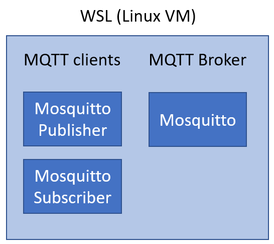
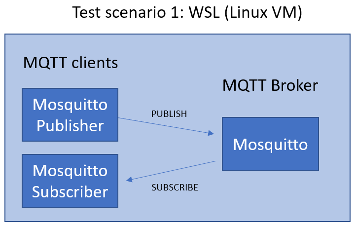

## MQTT - MQ Telemetry Transport

### Resumo:
- Protocolo de comunicação leve - ideal para devices restritos que não tem recursos para executar protocolos mais pesados e para devices que utilizam redes tarifadas (como celular) onde cada byte que trafega na rede é tarifado.
- Baseado no padrão de arquitetura Pub-Sub - Publisher x Subscribe onde, na maioria das vezes, existe a figura central de um broker que recebe e despacha as mensagens entre os nós conectados a ele.
- As mensagens enviadas ao broker são organizadas em tópicos (também chamados de feeds) cuja hierarquia é definida pelo modelo de negócio que a solução modela. 
- Qualidade de serviço (QoS) em MQTT pode ser 0, 1 ou 2. QoS 0 significa que mensagens são enviadas mas nenhuma confirmação é recebida. QoS 1 implica que a mensagem será entregue ao menos uma vez e uma confirmação será recebida dando conta da mensagem ter sido entregue. QoS 2 garante o envio e a confirmação que a mensagem foi enviada e recebida exatamente uma vez (sem duplicações).

### Utilizando MQTT na prática

Para exercitar o conhecimento em MQTT vamos precisar de um MQTT Broker para onde vamos enviar mensagens e de onde também vamos receber mensagens. É neste momento que o WSL (Windows Subsystem for Linux) vai ser útil: vamos instalar um MQTT Broker no Ubuntu e acessar este serviço via linha de comando para entendê-lo. 

### Video

O link abaixo para o meu canal do YouTube traz um pouco mais de detalhes sobre o MQTT e a demonstração dos comandos abaixo. 

[](https://youtu.be/0oOecMV_rrI)

#### Setup do PC

Para executar os testes abaixo, é necessário um conjunto de ferramentas para enviar dados, receber dados e um serviço (MQTT Broker) que centraliza as mensagens e as redistribui. Essas ferramentas (mosquitto e mosquitto-clients) estão disponíveis apenas para Linux por esse motivo fizemos a instalação do WSL (Windows Subsystem for Linux) que vai permitir a utilização dessas ferramentas no Windows. 



#### Instalar o Mosquitto MQTT Broker

Abra o WSL e execute os seguintes comandos:

```bash
sudo apt-get install mosquitto -y
sudo apt-get install mosquitto-clients -y
```

O primeiro comando instala o MQTT Broker e o segundo instala um conjunto de clientes que vamos usar para conectar e testar o Mosquitto.

Para facilitar este exercício vamos usar o Windows Terminal.

#### Explorando o Mosquitto

Vamos explorar os seguintes conceitos de MQTT:
-	Publish
-	Subscribe
-	Topics
-	QoS

#### Mosquitto Subscribe

- Detalhes do comando Mosquitto Subscribe [aqui](https://mosquitto.org/man/mosquitto_sub-1.html) (em inglês).
- Abra um novo painel no Windows Terminal (alt+shift+plus) e inicie o Mosquitto
  
```bash
mosquitto
```

- Abra outro painel no Windows Terminal (alt+shift+plus) e teste:
  
```bash
mosquitto_sub -d -t /dev/test
```
Onde: 
 - mosquitto_sub = subscreve a um tópico chamado /dev/test no broker parta receber notificações de publicações exclusivamente a este tópico
 - -d = debug - mostra detalhes da comunicação entre o cliente e o broker
 - -t  = tópico
 - /dev/test = nome do tópico a que se deseja subscrever
 - -u = username (não é necesário quando o acesso anônimo é permitido no broker, como é o nosso caso agora)
 - -P = password (não é necesário quando o acesso anônimo é permitido no broker, como é o nosso caso agora)
 - -h = host IP (IP da maquina onde o broker está instalado. Se nao for utilizado, o default é LOCALHOST, que é o nosso caso)

Porque precisamos de duas janelas abertas? Note que estamso usando WSL então o Mosquitto é executado apenas enquanto essa janela está aberta. Numa maquina Linux, poderíamos rodar o Mosquitto como um serviço. 
  
#### Mosquitto Publish

- Detalhes do comando Mosquitto Publish [aqui](https://mosquitto.org/man/mosquitto_pub-1.html) (em inglês).
- Abra um novo painel no Windows Terminal (alt+shift+plus) e inicie o Mosquitto (caso ele nao esteja rodando ainda, uma janela com o Mosquitto é o bastante)
  
```bash
mosquitto_pub -d -t /dev/test -m "mensagem de teste"
```
Onde: 
 - mosquitto_pub = publica uma mensagem a um tópico chamado /dev/test no broker 
 - -d = debug - mostra detalhes da comunicação entre o cliente e o broker
 - -t  = tópico
 - /dev/test = nome do tópico a que se deseja publicar
 - -u = username (não é necesário quando o acesso anônimo é permitido no broker, como é o nosso caso agora)
 - -P = password (não é necesário quando o acesso anônimo é permitido no broker, como é o nosso caso agora)
 - -h = host IP (IP da maquina onde o broker está instalado. Se nao for utilizado, o default é LOCALHOST, que é o nosso caso)
 - -q = QoS utilizado - pode ser 0, 1 ou 2. Se nao for informado o default é zero.

#### Cenário dessa configuração

Nos exemplos acima utilizamos o Mosquitto como o MQTT Broker e os clientes para enviar e receber dados do Broker. Todos eles estao sendo executados localmente dentro do ambiente do WSL (uma maquina virtual Linux dentro do Windows) como a figura abaixo ilustra.

