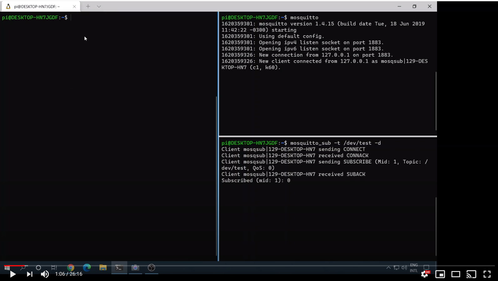
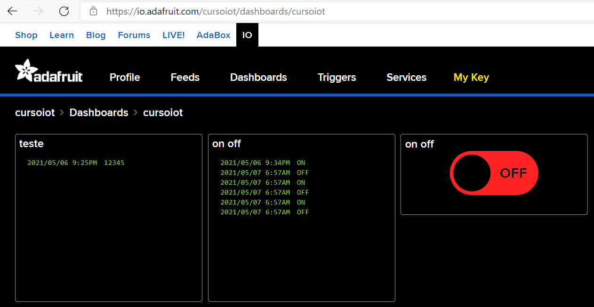

## MQTT - Continuação

Na aula antetior vimos os comandos básicos do MQTT mas todo acesso foi anônimo. Isso certamente não é o que acontece na prática e o acesso autenticado é o padrão. 

Para isso vamos testar o acesso a MQTT Brokers que estão na nuvem e que são gratuitos, alguns com acesso anônimo e outros que vão exigir credenciais para acesso.

### Video

O link abaixo para o meu canal do YouTube traz um pouco mais de detalhes sobre o MQTT e a demonstração dos comandos abaixo. 

[](https://youtu.be/-4V2jQ5Flkw)

### Servidores MQTT na Nuvem

Existem varios serviços de teste de MQTT Brokers na internet, vamos utilizar um que permite acesso anônimo.

[**Mosquitto**](https://mosquitto.org/) - tem seu serviço online de test em test.mosquitto.org. 

Para testar abra dois painéis no Windows Terminal com o WSL /Ubuntu e execute cada comando em um painel ( não vamos usar essa maquina virtual como servidor, mas ainda precisamos do cliente de MQTT para o teste)

```bash
mosquitto_sub -d -t /dev/test -h "test.mosquitto.org"
mosquitto_pub -d -t /dev/test -m "mensagem de teste" -h "test.mosquitto.org"
```
<br>
A esta altura voce já deve ter notado que, por permitir acesso anônimo, qualquer pessoa no mundo pode publicar dados para o tópico /dev/test e, da mesma forma, podem subscrever a este tópico e receber todas as publicações que voce fizer. 
<br>

### Servidor MQTT gratuito - Adafruit

[Adafruit](www.adafruit.com) é uma empresa americana fundada por Limor Fried (mais conhecida como Lady Ada) e que presta um papel importantíssimo na comunidade Maker. Um de seus produtos é uma versão minimalista de nuvem chamado [Adafruit.IO](https://io.adafruit.com/) que permite acesso gratuito a um MQTT Broker com as seguintes características:
1. MQTT Broker 
1. Limite de 30 mensagens por minuto (1 mensagem a cada 2 segundos se voce só tiver um device conectado ou uma mensagem por minuto se voce tiver 30 devices conectados)
1. 30 dias de armazenamento dos dados recebidos
1. Limite de 5 tópicos / feeds
1. Inteface gráfica para visualizacão de dados e interacao com os devices

**<Opinião>**: Existe ainda uma versão paga deste serviço que é menos restritiva quando a limites, mas ainda está longe de atender a aplicações de IoT mais sérias. O Adafruit.IO é perfeito para makers e para que voce controle seu abridor de garagem ou para controlar remotamente um abajur (que sao projetos sensacionais, diga-se de passagem) mas se voce está considerando fazer de IoT uma carreira ou voce tem um cliente que vai pagar pelo serviço, existem alternativas profissionais de IoT que tem benefícios que ultrapassam a capacidade atual do Adafruit.IO. **</Opinião>**

Crie uma conta gratuita em io.adafruit.com (em inglês) ao clicar em "Get started for free".

Após ter criado a sua conta, verifique suas credenciais que ficam no menu "IO" na parte superior a direita da tela. Clique neste item e anote seu username e active key (que é a sua senha).

### Teste com sua conta da Adafruit

Para testar abra dois painéis no Windows Terminal com o WSL /Ubuntu e execute cada comando em um painel ( não vamos usar essa maquina virtual como servidor, mas ainda precisamos do cliente de MQTT para o teste)

```bash
mosquitto_sub -d -t [insira seu username aqui]/feeds/dev/test -u "[insira seu username]" -P "[insira sua senha - key]" -h "io.adafruit.com"
mosquitto_pub -d -t [insira seu username aqui]/feeds/dev/test -m "mensagem de teste" -u "[insira seu username]" -P "[insira sua senha - key]" -h "io.adafruit.com"

Exemplo de como o comando ficaria:
mosquitto_pub -d -t cursoiot/feeds/teste -m "123" -u "cursoiot" -P "p@2ex%rFr!" -h "io.adafruit.com"
```

Imagem do Dashboard após a criação de dois blocos de streaming, um subcrevendo ao tópico "teste" e outro ao tópico "on off", e um outro bloco de toggle (chave liga-desliga) que - ao mesmo tempo - subscreve e pode publicar no tópico "on off".

 
