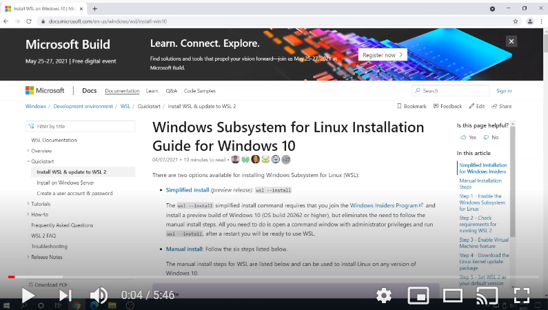

## Setup da máquina de desenvolvimento

O primeiro passo no curso é fazer o setup da máquina que será utilizada para o desenvolvimento no decorrer do curso. Ela pode ser um desktop ou laptop e precisa ser capaz de rodar o Windows 10. Esta máquina precisa ter ao menos uma porta USB disponível e voce precisa ter um usuário com permissão de instalar e executar softwares como administrador.

Embora a maioria dos aplicativos mencionados aqui estejam disponíveis para Linux e Mac, 100% dos meus exemplos utilizam um PC rodando Windows 10 e, quando necessário o uso de Linux, o WSL (Windows Subsystem for Linux) será a opção.Todos os aplicativos utilizados são gratuitos.

### Video

O link abaixo para o meu canal do YouTube mostra a instalação apenas do WSL dado que este passo é um pouco mais complicado que os demais. 

Todos os demais passos requerem apenas a instalação com todas as opções default. 

### Instalação

1. **Visual Studio Code** - VS Code - [link para instalação](https://code.visualstudio.com/Download) : Esta vai ser a nossa IDE (integrated development environment) para programação no decorrer deste curso.

1. **Arduino IDE** - [Link para instalação](https://www.arduino.cc/en/software): Além de ser uma IDE para desenvolvimento para Hardware. Quando estiver neste processo, aceite a instalação de todos os drivers duntante o setup. 

1. **WSL - Windows Subsystem for Linux** - [Link para instalação](https://docs.microsoft.com/en-us/windows/wsl/install-win10): WSL provê recursos para executar uma versão completa de Linux dentro do Windows o que pode ser útil para cenários em que códigos e comando estão disponíveis apenas para Linux. 

1. **Windows Terminal** - [Link para instalação](https://www.microsoft.com/en-us/p/windows-terminal/9n0dx20hk701): aplicação de terminal, ferramentas de linha de comando e shell com inúmeras funcionalidades de customização que fazem dela uma ferramente muito útil aos desenvolvedores. 

1. **Tera Term** - [Link para instalação](https://osdn.net/projects/ttssh2/releases/): Esta é uma aplicação de terminal que, no nosso caso, vai permitir monitorar portas seriais do computador para visualização de mensagens da placa de desenvolvimento. Se voce já for usuário de outra ferramenta como Termite, PuTTY, etc, pode ignorar este passo.

1. **Git** - [Link para instalação](https://git-scm.com/downloads): cliente de Git para Windows, provê acesso aos  comandos do Git a partir de qualquer prompt de comando ou aplicativos como o VS Code.